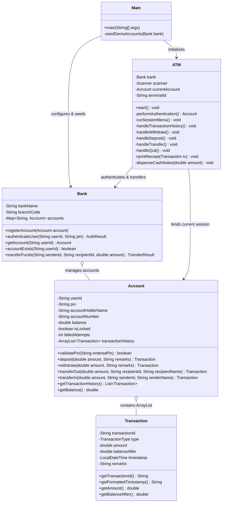

# 🏧 ATM Interface

An enterprise-grade, Object-Oriented **ATM Interface Simulation** developed in Java. Features a sleek ANSI-styled console interface, 3-attempt PIN security lockout, real-time balance validation, realistic cash denomination dispensing, thermal receipt generation, and an interactive modern web presentation companion.

---

## 📋 Project Checklist & Requirement Compliance

| Requirement | Specification | Implementation Details | Status |
| :--- | :--- | :--- | :---: |
| **Startup Prompt** | User ID & 4-Digit PIN | Authenticates with Central Bank ledger; denies access after 3 failed attempts |  **Fulfilled** |
| **Option 1** | Transaction History | Formatted tabular statement from internal `ArrayList<Transaction>` |  **Fulfilled** |
| **Option 2** | Withdraw | Fast Cash & Custom input, verifies balance, dispenses note denominations |  **Fulfilled** |
| **Option 3** | Deposit | Validates positive amount, immediate ledger update, receipt option |  **Fulfilled** |
| **Option 4** | Transfer | Recipient validation, self-transfer prevention, atomic two-account update |  **Fulfilled** |
| **Option 5** | Quit | Session closure, card ejection animation, goodbye banner |  **Fulfilled** |
| **Balance Verification** | Insufficient Funds Alert | Pre-validates balance before any debit; displays deficit details |  **Fulfilled** |
| **Storage Collection** | `ArrayList` Data Structure | All transactions stored in `ArrayList<Transaction>` with timestamps & IDs |  **Fulfilled** |
| **5 OOP Classes** | ATM, Account, Transaction, Bank, Main | Fully decoupled Object-Oriented architecture adhering to Encapsulation |  **Fulfilled** |
| **Menu Controller** | `switch-case` | Interactive console menu controlled via standard `switch-case` statement |  **Fulfilled** |

---

## 🏛️ Class Architecture & OOP Design

The project strictly fulfills the requirement of **at least 5 distinct Java classes**:



### OOP Principles Utilized:
1. **Encapsulation**: All fields in `Account`, `Transaction`, and `Bank` are `private`. Data mutations happen exclusively through validated methods (e.g., `deposit`, `withdraw`, `transferFunds`).
2. **Immutability**: `Transaction` records are immutable once instantiated, guaranteeing audit-trail integrity.
3. **Information Hiding**: Account numbers are displayed in masked format (`XXXX-XXXX-4589`) on receipts and screens.
4. **Separation of Concerns**: `Bank` manages ledger state; `Account` encapsulates individual balance and security rules; `ATM` governs terminal presentation and I/O; `Main` bootstraps the system.

---

## 🔑 Preloaded Test Accounts

Use any of these demo accounts when running the application or interactive showcase:

| User ID | 4-Digit PIN | Account Holder | Masked Account No. | Opening Balance |
| :---: | :---: | :--- | :---: | :---: |
| `1001` | `1234` | **Alice Vance** | `XXXX-XXXX-4589` | **$5,000.00** |
| `1002` | `4321` | **Bob Martin** | `XXXX-XXXX-2103` | **$2,500.00** |
| `1003` | `9999` | **Charlie Davis** | `XXXX-XXXX-6310` | **$10,000.00** |
| `1004` | `1111` | **Dana Scully** | `XXXX-XXXX-4812` | **$750.00** |

---

## 🚀 How to Run the Java Console Application

### Option A: Using One-Click Batch Script (Windows)
Double-click `run.bat` or execute in command prompt:
```cmd
run.bat
```

### Option B: Using PowerShell
```powershell
.\run.ps1
```

### Option C: Manual Compilation & Execution
```bash
# 1. Navigate to the project directory
cd ATM-Interface-Java

# 2. Compile source files into bin directory
javac -d bin src/*.java

# 3. Run the application
java -cp bin Main
```

---

## 🌐 Interactive Web Showcase (For Presentations & Viva)

An interactive, responsive fintech web simulator is included in the [`web-showcase`](file:///C:/Users/Dell/.gemini/antigravity-ide/scratch/ATM-Interface-Java/web-showcase/index.html) folder.

### Features of the Web Showcase:
- **Realistic ATM Kiosk Enclosure**: Complete with screen glass effect, card reader slot, illuminated card indicator, and receipt printer mouth.
- **Physical Keypad Simulator**: Interactive numeric keypad with Web Audio API sound effects for button beeps and cash dispenser motors.
- **Dynamic Cash Dispenser**: Visually dispenses banknotes on withdrawal.
- **Interactive Thermal Receipt**: Click the receipt slot or "Print Receipt" to view an authentic printable bank slip.
- **Instant Demo Fill**: One-click pills to auto-fill Alice, Bob, or Charlie credentials.

To launch:
Simply double-click `web-showcase/index.html` or open it in Google Chrome, Microsoft Edge, or any modern browser.

---

## 📸 Sample Console Outputs

### 1. Main Banking Menu
```text
+------------------------------------------------------------------+
|  User: Alice Vance          Account: XXXX-XXXX-4589              |
|  Available Balance: $5,000.00        Terminal: ATM-OASIS-7749    |
+------------------------------------------------------------------+
|                          MAIN BANKING MENU                       |
+------------------------------------------------------------------+
|                                                                  |
|   [1] Transaction History     Display statement of all transactions  |
|   [2] Withdraw Cash           Withdraw funds with balance check      |
|   [3] Deposit Funds           Credit money into your account         |
|   [4] Transfer Funds          Send money to another account ID       |
|   [5] Quit Session            Exit, print receipt and eject card     |
|                                                                  |
+------------------------------------------------------------------+
```

### 2. Transaction History Statement (From `ArrayList`)
```text
+----------------------+--------------+------------------+--------------+--------------+----------------------------------+
| Date & Time          | Txn ID       | Type             | Amount       | Post Balance | Remarks / Description            |
+----------------------+--------------+------------------+--------------+--------------+----------------------------------+
| 13-Sep-2026 17:47:45 | TXN-INIT-C2E | Deposit          | +$ 5,000.00 | $  5,000.00 | Initial Opening Balance          |
| 13-Sep-2026 17:47:46 | TXN-DEP-AF14 | Deposit          | +$ 1,500.00 | $  6,500.00 | ATM Cash Deposit                 |
| 13-Sep-2026 17:47:47 | TXN-WTH-3CA7 | Withdrawal       | -$   500.00 | $  6,000.00 | ATM Cash Dispenser               |
| 13-Sep-2026 17:47:48 | TXN-TRF-07E6 | Transfer Out     | -$ 1,000.00 | $  5,000.00 | Transfer to Bob Martin (ID: 1002)|
+----------------------+--------------+------------------+--------------+--------------+----------------------------------+
```

### 3. Insufficient Funds Handling
```text
 +-- [ INSUFFICIENT FUNDS ] --------------------------------
 | Transaction Declined!
 | Requested Amount  : $100,000.00
 | Available Balance : $5,000.00
 | Deficit           : $95,000.00
 +--------------------------------------------------------
```

### 4. Official Printable Thermal Receipt
```text
  +--------------------------------------------+
  |            OASIS GLOBAL BANK               |
  |          OFFICIAL CUSTOMER RECEIPT         |
  +--------------------------------------------+
  | Terminal ID  : ATM-OASIS-7749              |
  | Date & Time  : 13-Sep-2026 17:47:48        |
  | Account      : XXXX-XXXX-4589              |
  | Cardholder   : Alice Vance                 |
  | Txn Ref No.  : TXN-TRF_OUT-07E6B8          |
  +--------------------------------------------+
  | Txn Type     : TRANSFER OUT                |
  | Amount       : $1,000.00                   |
  | Ending Bal   : $5,000.00                   |
  | Status       : APPROVED (AUTH-89210)       |
  | Details      : Transfer to Bob Martin      |
  +--------------------------------------------+
  | Oasis Infobyte AICTE Internship - Task 3   |
  +--------------------------------------------+
```

---

## 🛡️ Security & Edge-Case Safeguards
- **3-Attempt Lockout**: Accounts are automatically locked upon 3 consecutive incorrect PIN entries.
- **Input Type Safety**: All numeric scanner prompts catch `InputMismatchException` and `NumberFormatException` so letters or symbols never crash the terminal.
- **Atomic Double-Entry Bookkeeping**: Inter-account fund transfers debit the sender and credit the recipient synchronously; if either step fails, funds are preserved.
- **Self-Transfer Guard**: Prevents users from transferring funds to their own User ID.
- **Negative & Zero Amount Rejection**: Prevents zero or negative monetary inputs.

---

## 👨‍💻 Submission Info
- **Project**: Oasis Infobyte Java Development Internship
- **Task**: Task 3 - ATM Interface
- **Technology**: Java 21 LTS (Console Application), HTML5, CSS3, JavaScript
- **Organization**: Oasis Infobyte in partnership with AICTE

- ## 🎥 Project Demonstration

Watch the complete demonstration of the ATM Interface on LinkedIn:

▶️ **[Watch Demo Video on LinkedIn]()**

The demonstration showcases the authentication process, ATM menu, banking transactions, validation, and transaction history.
